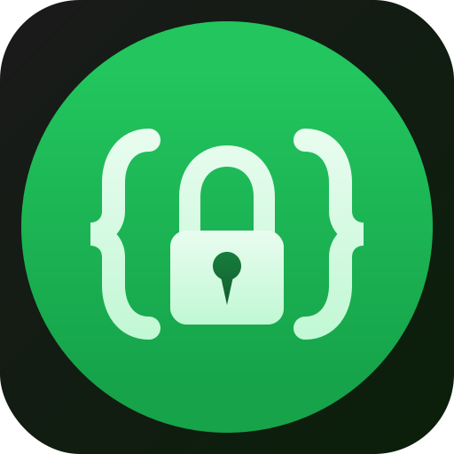

<div align="center">
  
  <h1>vars</h1>
  <p><strong>Encrypted, typed, schema-first environment variables.</strong></p>
  <p>One file. Zero SaaS. AI-safe by default.</p>
</div>

## 😩 The Problem

`.env` files are broken:

- **No encryption** — plaintext secrets readable by AI agents, IDE extensions, and accidental git commits
- **No types** — `process.env.PORT` is always `string | undefined`
- **No validation** — misconfigured envs crash at runtime, not build time
- **No team story** — "hey can someone DM me the .env?"
- **Environment drift** — prod has 47 vars, dev has 38, nobody knows which are needed where

## ✨ The Solution

```
# .vars — committed to git, values encrypted

DATABASE_URL  z.string().url().startsWith("postgres://")
  @dev     = enc:v1:aes256gcm:a1b2c3...:d4e5f6...:g7h8i9...
  @prod    = enc:v1:aes256gcm:j8fn2p...:t9u0v1...:w2x3y4...

PORT  z.coerce.number().int().min(1024).max(65535)
  @default = enc:v1:aes256gcm:e9f0g1...:h2i3j4...:k5l6m7...

API_KEY  z.string().min(32)
  @description "Primary API key for external service"
  @expires     2026-09-01
  @dev     = enc:v1:aes256gcm:p2q3r4...:s5t6u7...:v8w9x0...
  @prod    = enc:v1:aes256gcm:h0i1j2...:k3l4m5...:n6o7p8...
```

- **Schema + values + environments** in one file
- **All values encrypted** — variable names and Zod schemas are readable, values are not
- **PIN-protected key** — AI agents can't decrypt without a human-memorized PIN
- **Zod-native validation** — type errors at build time, not runtime
- **Generated TypeScript types** — full autocomplete and type safety

## 🚀 Quick Start

```bash
# Migrate from .env in 30 seconds
npx vars init

# Edit values
vars show          # decrypts vault.vars → unlocked.vars
# ... edit .vars/unlocked.vars in your IDE ...
vars hide          # re-encrypts unlocked.vars → vault.vars

# Run your app
vars run --env dev -- npm start
```

## 🔌 Framework Support

`vars run` works with **any** framework — no per-framework adapter needed. Just wrap your dev/build commands:

```json
// package.json
{
  "scripts": {
    "dev": "vars run --env dev -- next dev",
    "build": "vars run --env prod -- next build"
  }
}
```

`vars init` detects your framework and wraps the dev script automatically. Framework-specific prefixes (`NEXT_PUBLIC_*`, `VITE_*`, `PUBLIC_*`) work out of the box because `vars run` sets `process.env` before the framework starts.

## 🔒 Type Safety

```typescript
// Auto-generated by: vars gen
import { vars } from '#vars'

vars.DATABASE_URL              // Redacted<string> — safe to log
vars.DATABASE_URL.unwrap()     // actual value — explicit opt-in
vars.PORT                      // number — already coerced
vars.TYPO_VAR                  // TS error — doesn't exist
```

## 🤖 AI Safety

```
cat .vars/vault.vars  → ciphertext (encrypted)
cat .vars/key         → encrypted blob (PIN-protected)
vars show             → prompts for human PIN
vars hide             → prompts for human PIN
```

The only way to access secrets: human enters PIN. AI agents can't complete that step.

## ☁️ Deploy

Set **one env var** on your platform:

```
VARS_KEY=<your-master-key>
```

`.vars` is in the repo. `vars run` decrypts at build time. No dashboard env var management ever again.

## 📦 Packages

| Package | Description |
|---------|-------------|
| `@vars/core` | Parser, crypto, validator, `Redacted<T>` |
| `@vars/cli` | Command-line tool (`vars run`, `vars init`, etc.) |
| `@vars/lsp` | Language Server Protocol |
| `@vars/vscode` | VS Code / Cursor extension |

## 📖 Documentation

See [PRD.md](./PRD.md) for the complete specification.

## 📄 License

MIT
